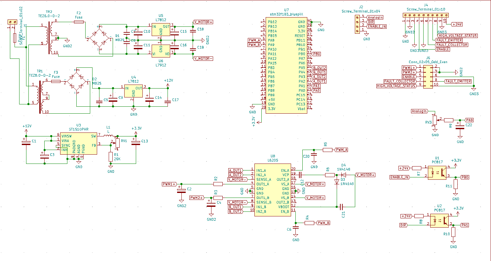

VFD Sine Wave generator

The project consists of a function generator modulating 2 sine waves with a 120degree phase shift. 
It s designed to work with a VFD witch turns them into commutation signals for a 3 phase motor.
The device features a Enable pin witch enables the output tranzistors and prevents unintended signal generation.
To change the direction and the angular speed of the motor 2 inputs are used.
The direction pin changes the the phase shift between 120 and 240 degrees.
The analog input uses a input signal 0-10V witch ich scaled down to the 0-3.3V range to change the frequency of the PWM generated sine wave between 2-167Hz.

Schematic

Board design

Demonstration of working prototype:
https://www.youtube.com/watch?v=0YkKMYZPY2g
